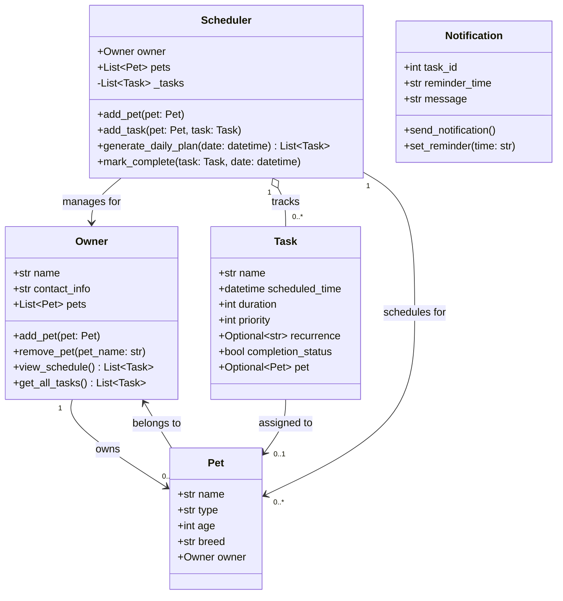

# PawPal+ Final UML Class Diagram

## Key design notes

- `Pet` and `Task` are Python **dataclasses** — fields, `__repr__`, and `__eq__` are auto-generated.
- `Task.pet` is set by `Scheduler.add_task()`, not at construction time, keeping Task creation clean.
- `Scheduler` is the single source of truth for the task list (`_tasks`). Pets no longer store their own tasks.
- `mark_complete` on a **daily** task appends a one-time follow-up for the next day; **weekly** tasks are simply closed out.
- `generate_daily_plan` returns *copies* of recurring task objects with `scheduled_time` adjusted to the requested date, so the original task objects are never mutated by the plan view.
